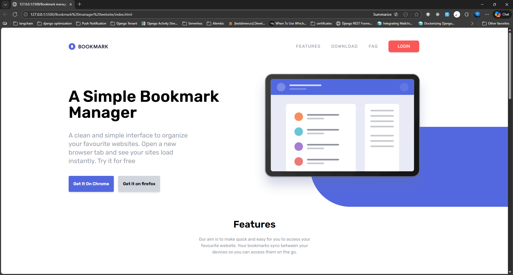

# Bookmark Manager Website

A modern and intuitive bookmark management application UI landing page built with HTML, Tailwind CSS, and JavaScript.

## 📸 Project Screenshot



## 📝 Description

The Bookmark Manager is a web-based application that allows users to save, organize, and manage their bookmarks efficiently. It features a clean, professional interface with responsive design that works seamlessly on desktop and mobile devices.

## ✨ Features

- **Add Bookmarks** - Save and store your favorite websites
- **Organize** - Categorize bookmarks for easy access
- **Search/Filter** - Quickly find bookmarks you need
- **Delete** - Remove unwanted bookmarks
- **Responsive Design** - Works on all device sizes
- **Local Storage** - Bookmarks persist in browser

## 🛠️ Technologies Used

- **HTML5** - Semantic markup structure
- **Tailwind CSS** - Utility-first styling framework
- **JavaScript (ES6+)** - Interactive functionality
- **CSS Flexbox/Grid** - Layout techniques

## 📂 Project Structure

```
Bookmark manager website/
├── index.html              # Main HTML file
├── input.css              # Source CSS with Tailwind directives
├── package.json           # Project dependencies
├── tailwind.config.js     # Tailwind configuration
├── css/
│   └── style.css          # Compiled Tailwind CSS
├── js/
│   └── script.js          # JavaScript functionality
└── images/                # Project images and assets
```

## 🚀 Getting Started

### Installation

1. Navigate to the project folder:

   ```bash
   cd "Bookmark manager website"
   ```

2. Install dependencies:

   ```bash
   npm install
   ```

3. Start the Tailwind CSS development server:
   ```bash
   npm run watch
   ```

### Usage

1. Open `index.html` in your web browser
2. Use the UI to add, manage, and organize bookmarks
3. Changes are automatically saved to your browser's local storage

## 📋 Key Components

- **Header Section** - Navigation and branding
- **Bookmark Form** - Input area for adding new bookmarks
- **Bookmarks Display** - Grid/list view of saved bookmarks
- **Action Buttons** - Edit, delete, and organize options
- **Search Bar** - Find bookmarks quickly

## 🎨 Customization

### Modifying Styles

1. Edit `input.css` to add custom Tailwind classes
2. Run the build process to generate updated `style.css`
3. Customize `tailwind.config.js` for brand colors and fonts

### Adding Features

Modify `js/script.js` to add new functionality:

- Advanced filtering options
- Export/import bookmarks
- Categories or tags
- Bookmark preview

## 📚 Learning Outcomes

By studying this project, you'll learn:

- How to structure HTML forms with Tailwind CSS
- Managing state with vanilla JavaScript
- Using browser's Local Storage API
- Creating responsive components
- Event handling and DOM manipulation

## 🔗 Useful Links

- [Tailwind CSS Documentation](https://tailwindcss.com/)
- [MDN - HTML Forms](https://developer.mozilla.org/en-US/docs/Learn/Forms)
- [MDN - Local Storage](https://developer.mozilla.org/en-US/docs/Web/API/Window/localStorage)

## 💡 Tips for Enhancement

- Add categories or tags for better organization
- Implement bookmark search and filtering
- Add drag-and-drop functionality
- Create an export/import feature
- Add bookmarks preview tooltips

## 📝 Notes

- All bookmarks are stored in browser's Local Storage
- Clearing browser data will delete saved bookmarks
- Works offline after initial load
- No backend server required

---

**Back to [Main README](../README.md)**
